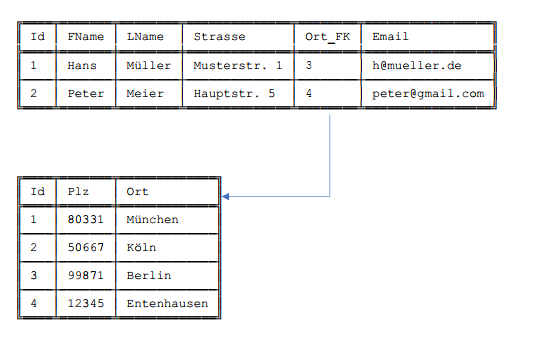
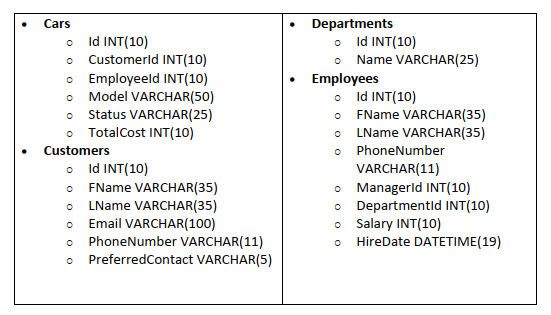

# Tabellendesign

Die Hauptmotivation des Tabellendesign ist es innerhalb des rationalen Schemas folgende Ziele zu verfolgen:

- Redundanz und Inkonsistenz vermeiden
- Anomalien vermeiden
- Verlustlose Zerlegungen finden
- Abhängigkeiten bewahren

## Normalformen
Unter Normalisierung eines relationalen Datenbankmodells versteht man die Aufteilung von Attributen in mehrere Relationen (Tabellen) mithilfe der Normalisierungsregeln und deren
Normalformen, sodass eine Form entsteht, die keine vermeidbaren Redundanzen mehr enthält.
Ziel der Normalisierung ist eine redundanzfreie Datenspeicherung zu erstellen. Redundanzfrei bedeutet, dass Duplikate entfernt werden können, ohne dass es zu Informationsverlusten kommt.
Weiterhin soll die Normalisierung Anomalien entfernen. Im Normalisierungsprozess gibt es fünf Normalformen, welche im Folgenden genauer erklärt werden.
In der Datenbankentwicklung ist die Dritte Normalform oft ausreichend, um die perfekte Balance aus Redundanz, Performance und Flexibilität für eine Datenbank zu gewährleisten. Natürlich gibt es auch Sonderfälle, z.B. im wissenschaftlichen Bereich, wo eine Datenbank bis zur 5. Normalform normalisiert werden kann bzw. muss.

## Erste Normalform
_Die Erste Normalform (1NF) ist dann gegeben, wenn alle Informationen in einer Tabelle atomar vorliegen._
Es bedeutet, dass jede Information innerhalb einer Tabelle eine eigene Tabellenspalte bekommt und zusammenhängende Informationen, wie zum Beispiel die Postleitzahl (PLZ) und der Ort, nicht in
einer Tabellenspalte vorliegen dürfen.

Sowohl die Werte in der Spalte "Name" als auch die "Adresse" sind nicht *atomar* gespeichert. 
Um die 1. Normalform zu erfüllen sollte das Tabellendesign so aussehen:

Die Spalten wurden entsprechend aufgeteilt.

_Hinweis:_
Ob die Spalte "Strasse" aufgeteilt werden sollte in "Straße" und "Hausnummer" wirft regelmäßig Diskussionen auf. 
Bei Straße und Hausnummer wird es in der Regel nicht notwendig sein sie zu teilen, da eine Suche oder Abfrage auf Hausnummern ohne Straßen in der Praxis eher unüblich ist. 

## Zweite Normalform

Eine Relation befindet sich in der zweiten Normalform, wenn 
1.	Sie in der ersten Normalform ist und 
2.	jedes Nicht-Schlüssel-Attribut vom Primärschlüssel voll funktional abhängig ist.

Zuerst müssen wir den Begriff Primärschlüssel aufklären: Er wird zur eindeutigen Identifizierung eines Datensatzes verwendet. In einer normalisierten Datenbank besitzen alle Tabellen einen Primärschlüssel.
In unserem Beispiel handelt es sich um die Spalte "Id", welche eine fortlaufende eindeutige Nummer für jeden Kundeneintrag in der Tabelle führt. Nun müssen wir also sicherstellen, dass jedes Feld der Tabelle sich inhaltlich auf die Schlüsselspalte bezieht:

## Dritte Normalform
Eine Relation befindet sich in der dritten Normalform, wenn 
1.	Sie in der zweiten Normalform ist und 
2.	jedes Nicht-Schlüssel-Attribut nicht transitiv vom Primärschlüssel abhängig ist, d.h. aus keinem Nicht-Schlüssel-Attribut folgt ein anderes Nicht-Schlüssel-Attribut. 

Diese Definition ist erst einmal schwer zu verstehen. Mit einer weiteren Grafik lässt sich jedoch aufzeigen, was mit Punkt 2 gemeint ist:

Die Spalte "Straße" hängt von "Ort" ab und das obwohl Ort kein Primärschlüssel-Attribut ist.   Um den Verstoß aufzulösen wird eine zweite Tabelle "Cities" für die Orte gebildet und in der "Customers" Tabelle ein Verweis gespeichert. Den Verweis nennt man Fremdschlüssel, was oftmals mit „FK“ in der Spaltenbezeichnung abgekürzt wird. 

Wenn wir nun die neu erstellte Tabelle "Cites" mit den Spalten "Id" und "Ort" genau ansehen stellen wir fest, dass sie gegen die 2. Normalform verstößt. Dementsprechend sollen auch hier drei Spalten anstelle von zwei gebildet werden, sodass sich folgendes Bild ergibt:

## Übung 1 (Tabellendesign)

1.	Die Daten eines Busreiseunternehmens sollen in einer relationalen Datenbank abgespeichert werden. Die folgende Abbildung zeigt den Datenbestand in einer nicht-Normalisierten Form.
Führe schrittweise die Normalformen 1–3 durch.

2.	Welche weiteren Spalten wären denkbar und welchen Typ sollten diese haben? Zur Auswahl stehen die folgenden Datentypen: Zahl, Datum, Text, Zahl (Währung). 

## Übung 2 (Arbeit mit Mysql Workbench)

Wir möchten vier Tabellen anlegen: Abteilungen, Angestellte, Kunden und Autos.
Wobei die Beziehungen zwischen den Tabellen folgendermaßen definiert sind:
•	Jede Abteilung kann 0 oder mehr Mitarbeiter haben 
•	Jeder Kunde kann 0 oder mehr Autos haben 

Die Syntax für die erste Tabelle "Abteilung" ist folgende:

CREATE TABLE Departments (
    Id INT NOT NULL AUTO_INCREMENT,
    Name VARCHAR(25) NOT NULL,
    PRIMARY KEY(Id)
);

Die Tabelle "Departments" (englisch für "Abteilung") hat zwei Spalten: "Id" und "Name". Der Primärschlüssel ist "Id". Der Schlüssel entspricht hier eine natürlichen Zahl, die fortlaufend hochgezählt wird.

Für jede Spalte müssen wir einen Namen spezifizieren. Spaltennamen dürfen keine Leerzeichen enthalten (nutze stattdessen den Unterstrich). Ebenso darf keine Zahl am Anfang des Namens stehen. Ein Minus ist ebenfalls problematisch, dort lieber den Unterstrich verwenden.

Autoincrement ist eine Hilfsfunktion die mittlerweile in die meisten Datenbanken Einzug gehalten hat. Es handelt sich um einen Mechanismus den Zahlenwert in der Primärschlüsselspalte 

Bei Anlegen der Tabelle:
CREATE TABLE Departments (
    Id INT NOT NULL AUTO_INCREMENT,
    Name VARCHAR(25) NOT NULL,
    PRIMARY KEY(Id),
);

Wenn wir es nachträglich bei der bereits angelegten Tabelle ändern wollen:

ALTER TABLE Departments CHANGE Id Id INT(10) AUTO_INCREMENT PRIMARY KEY;

1.	Lege folgende vier Tabellen an:

Achten auf die Reihenfolge, da Spalten von Tabellen auf Spalten anderer Tabellen verweisen.

2. Identifiziere in jeder Tabelle den Primärschlüssel.
3. Stelle sicher, dass jedes Feld den passenden Datentypen hat.

Optional:
Füge der Tabelle Employees eine zusätzliche Spalte Plz hinzu. 
Löschen die zuvor angelegte Spalte Plz wieder.
